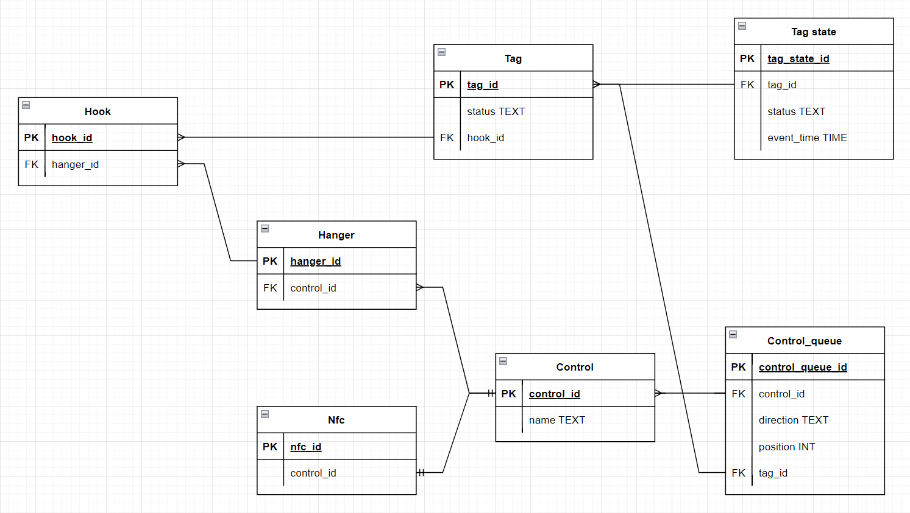

# Структура базы данных

Предполагаемый диалект - SqlLite

## Таблицы

### Hook

Список крючков в гардеробе

Поля таблицы:
* `hook_id` - номер крючка
* `hanger_id` - номер вешалки

### Nfc

Список NFC-считывателей

Поля таблицы:
* `nfc_id` - номер NFC-датчика
* `control_id` - номер пульта гардеробщика

### Control

Список пультов управления гардеробщиков

Поля таблицы:
* `control_id` - номер пульта гардеробщика
* `name` - название пульта (не обязательно)

### Hanger

Список пролётов с крючками (контроллеров RGB-лент)

Поля таблицы:
* `hanger_id` - номер вешалки
* `control_id` - номер пульта гардеробщика

### Tag

Список NFC-меток в системе

Поля таблицы:
* `tag_id` - номер метки (значение, считанное NFC-датчиком)
* `status` - состояние метки в системе
* `hook_id` - номер крючка, к которому привязана метка

Возможные состояния:
    `push` - вещь необходимо повесить
    `pushed` - вещь висит
    `pull` - вещь необходимо снять
    `pulled` - вещь снята

### Tag_state

Список операций, совершаемых с метками

Поля таблицы:
* `tag_state_id` - номер записи
* `tag_id` - номер метки
* `status` - её статус
* `event_time` - время события

### Control_queue

Состояние очереди пульта управления

Поля таблицы:
* `control_queue_id` - номер потока очереди
* `control_id` - номер пульта гардеробщика
* `direction` - направление очереди (занесение/выдача)
* `position` - позиция в очереди (1 - 3)
* `tag_id` - номер метки

